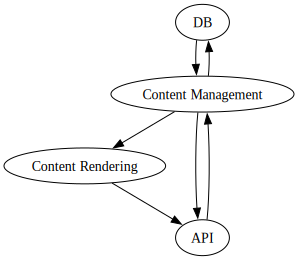

# QCIF Chat App

## Architecture

### Running the Server

Run on of the following commands from the project root to start the server:
- `cabal run QCIF`
- `docker-compose up web --build`

#### Tests
Run one of the following commands to run the test suite:
- `cabal run QCIF-test`
- `docker-compose up test --build`

### Storage
Application data is being stored in a relational database, with the current version utilising SQLite.

The databases for both the server and testing server are stored in a directory called `db` under the project root. This directory is also used by the `docker-compose.yaml` file to map existing databases into the docker containers as a volume.

SQLite was chosen for several reasons for this project:
  - No database management outside of the application server.
  - Similar data model and commands between both SQLite and PostgreSQL, SQLite's type system notwithstanding. 
  - Available migration path from SQLite to PostgreSQL. With the SQLite Foreign Data Wrapper for PostgreSQL, migrations from SQLite will be relatively painless, with the possibility of exporting data back to SQLite.

#### Data Migrations
Support for schema changes is included, and the server can be started without a given database. When no database is found, a new one will be created before being updated to the current schema. If an older schema version is detected upon server start up, migration steps will be applied one-by-one until the database matches the expected schema version.

__WARNING:__ the server does not inspect the table schema as used by SQLite, it uses a version table and blindly applies changes. This is fragile if the database is modified outside of the server process.

#### Backups
Backing up the server is relatively trivial as all state is stored in a single SQLite file. Shutdown the server, backup the database file, and restart the server.

### Web API
#### Clients
The web API supports both JSON and HTML clients, sharing most routes.

HTML clients have a few more routes that provide pages and forms to help them interact with the core API.
The HTML version of the API is following the [HATEOAS](https://en.wikipedia.org/wiki/HATEOAS) principle, allowing clients to be completely uncoupled from the semantics of the API.

[HTMX](https://htmx.org/) is used on browser clients to perform minimal updates to pages, and to help set cookies and XSRF tokens on requests.

#### OpenAPI Documentation
OpenAPI 3 is available at `/swagger.json` when the server is running. This documentation is generated at runtime based on the type information describing the API and it's responses.

The OpenAPI documentation is not an authorative specification of the API, but rather an additional tool for client developers.

#### Authentication
All routes expecting authentication can use any of the following methods.
- Basic Auth
- JWT Bearer tokens
- Cookie tokens

JWTs are returned as `Set-Cookie` headers, and are accepted if used for `Authorization: Bearer ...` tokens. This allows browsers to mostly "just work" with some help from HTMX for setting XSRF tokens on requests.

JWTs and Cookies can be created by the `/login` and `/register` routes.

### Content Management and Rendering
The server is split into two main sections, content management and rendering.

Rendering is performed statically only using the given inputs. This allows simple rendering routes to mostly be used "as-is" in the API. More complex pages for rendering users and messages can be confident that they have all of the expected information when they are called and permission checks, if any, have been applied.

Content management is is focused on making sure that requests are sane, and that data ends up where it is needed. Wrapper data structures are used to assist the rendering code in bundling data, or otherwise applying some context to it before it is handed over to the server to pick from the available content-types.

__Note:__ The line of content rendering and management gets fuzzy when looking at JSON encoded data. The JSON encoders and decoders are defined along side their type definitions in the content management side of the API. This was done to minimise the amount of [orphan instances](https://wiki.haskell.org/Orphan_instance) in the code base, as I'm already writing orphan instances for the HTML rendering. Additionally, leaving the JSON instances next to their type definitions helps to avoid circular imports.

### Block Diagram
